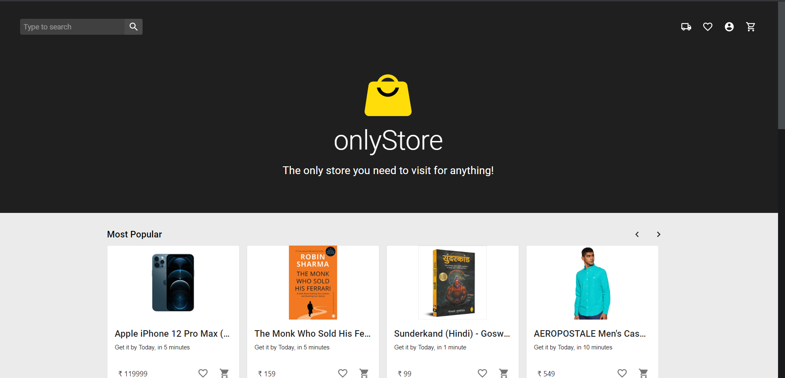
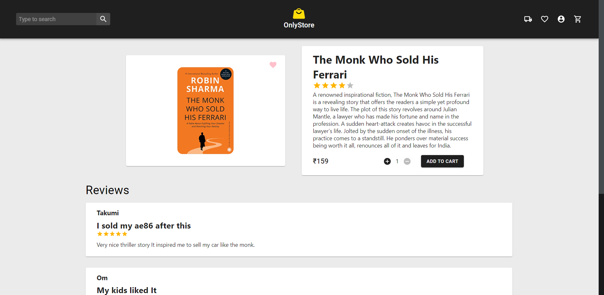
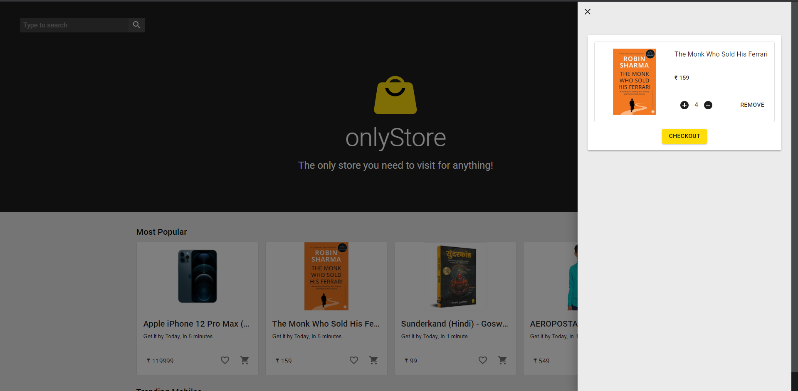
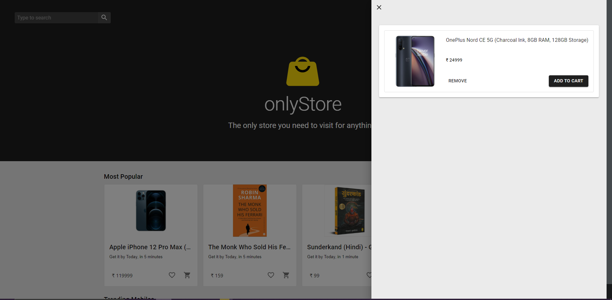
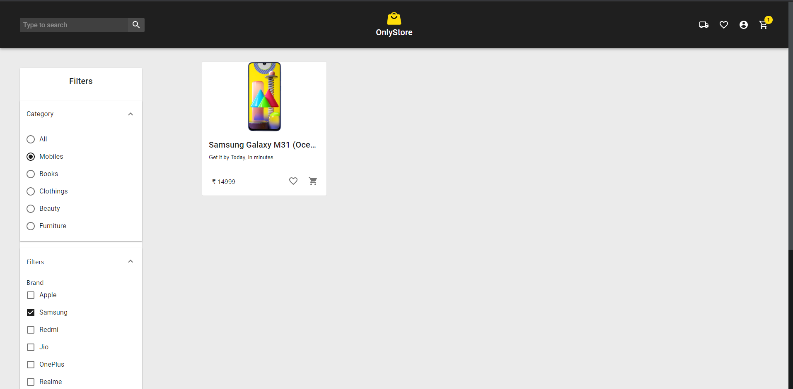
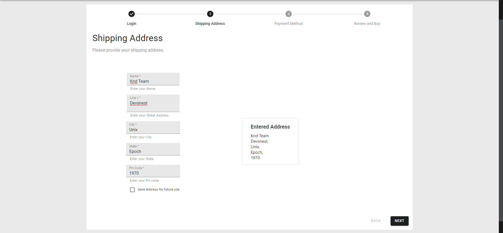
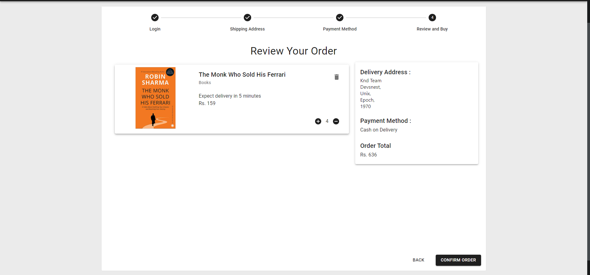
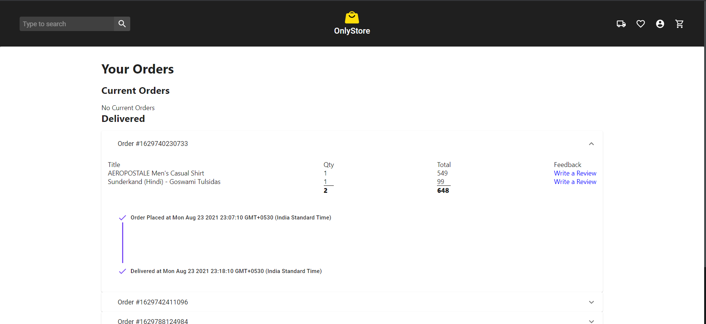

A Ecommerce website designed using only frontend for a frontend only hackathon. It features fully functional localStorage based login,cart,wishlist and order system.

### [Use it Here](https://knd-devsnest.github.io/onlystore/#/)

## Screenshots

|                                               |                                                   |
| --------------------------------------------- | ------------------------------------------------- |
|           |           |
|  |  |
|         |          |
|    |             |

## Features
- Material design, Landing page with different categories, Product details page
- Fully Fledged Cart, wishlist and order system using local storage to persist on reload
- Ability to give review after a order has been delivered which also persists in local storage
- Login and registeration system using local storage uniquely saving cart, wishlist, reviews and  orders
- Search with Filters functionality

## Using the App
- use `yarn dev` to start the dev server

- or `yarn build` to build a bundled version

## Contributors
- [Shubham Lingayat](https://github.com/seebham)
- [Swanand Buva](https://github.com/destro1108)
- [Aryan Gupta](https://github.com/aguyran)
- [Sanskar Chaware](https://github.com/iHatePhysics)
- [Kaushik Vrudhula](https://github.com/kaushikvrudhula)
- [Harsh Dhoble](https://github.com/HarshDhoble)
- [Ritik Gour](https://github.com/Ritik947)